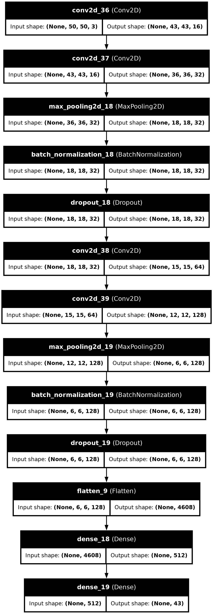
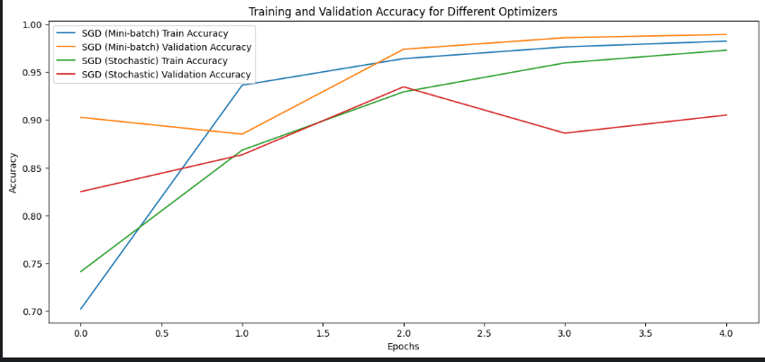
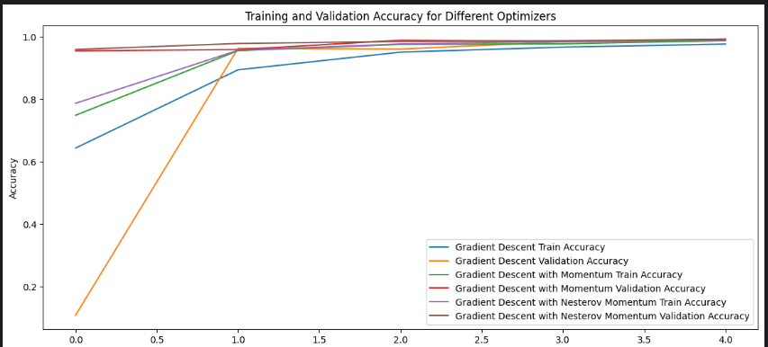
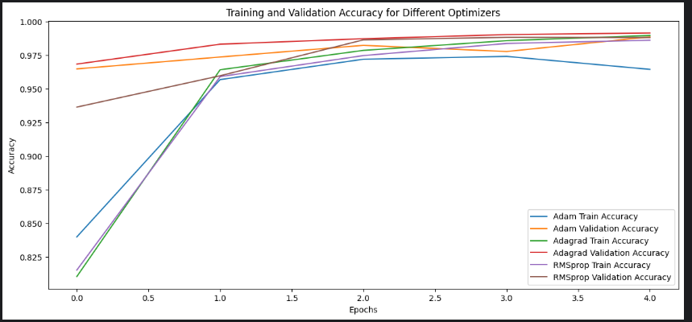

# Lab Report: Comparison of Optimization Algorithms

## Abstract
This lab report presents the comparison of different optimization algorithms for training a custom CNN model on the Traffic Sign dataset. The experiment was conducted using Google Colab and Kaggle for their GPU resources. The optimization algorithms were categorized into three groups: Gradient Descent variants, SGD variants, and other optimizers like Adam, RMSProp, and Adagrad. The performance of these algorithms was evaluated based on accuracy, and checkpoints were utilized to ensure training continuity in case of interruptions.

## Introduction
Optimization algorithms play a crucial role in the training of deep learning models. Different optimizers can significantly affect the model's convergence speed and final accuracy. This lab report aims to compare the performance of several popular optimization algorithms by training a custom CNN on the Traffic Sign dataset. The comparison includes Gradient Descent, Mini-batch SGD, Stochastic Gradient Descent, Gradient Descent with Momentum, Gradient Descent with Nesterov Momentum, Adam, RMSProp, and Adagrad.

## Methodology

### Environment Setup
Due to the resource requirements of deep learning algorithms, we used Google Colab and Kaggle for their free GPU resources. Initially, Google Colab was set up as the development environment, with necessary files installed and scripts created to download the Traffic Sign dataset from Kaggle. However, due to the limited GPU time on Google Colab's free version, the project was migrated to Kaggle, which offers 32 hours of free GPU usage per week.

### Data Preparation
The Traffic Sign dataset was downloaded and preprocessed. The images were reshaped, normalized, and converted into categorical format for model training.

### Model Architecture
A custom CNN model was created with the following layers:
- Convolutional layers with ReLU activation
- Max pooling layers
- Batch normalization
- Dropout layers
- Fully connected layers
- Output layer with softmax activation

### Checkpointing
To prevent the need to restart training from scratch in case of interruptions, checkpoints were implemented to save model weights at each epoch. The model checks for existing checkpoints at the beginning of training and resumes from the latest checkpoint if available.

### Training and Evaluation
The model was trained using three different groups of optimization algorithms:
- **Group 1:** Gradient Descent (GD/Batch GD), Mini-batch SGD, Stochastic Gradient Descent
- **Group 2:** Gradient Descent, Gradient Descent with Momentum, Gradient Descent with Nesterov Momentum
- **Group 3:** Adam, RMSProp, Adagrad

Each optimizer was trained for the same number of epochs, and the accuracy was recorded. The results were saved in a dictionary for later visualization and comparison.

## Results and Discussion

### Group 1: SGD Variants
- **SGD (Mini-batch):** 98.62%
- **SGD (Stochastic):** 93.01%
- **Best optimizer:** SGD (Mini-batch) with accuracy: 98.62%
  
### Group 2: Gradient Descent Variants
- **Gradient Descent:** 98.69%
- **Gradient Descent with Momentum:** 99.14%
- **Gradient Descent with Nesterov Momentum:** 98.71%
- **Best optimizer:** Gradient Descent with Momentum with accuracy: 99.14%
  
### Group 3: Other Optimizers
- **Adam:** 99.05%
- **Adagrad:** 98.16%
- **RMSprop:** 98.81%
- **Best optimizer:** Adam with accuracy: 99.05%
 
## Conclusion and Future Work
The experiments demonstrated that different optimization algorithms significantly impact model performance. Among the tested algorithms, Gradient Descent with Momentum and Adam showed the highest accuracies in their respective groups. Checkpointing proved to be an effective method to ensure training continuity in case of interruptions.

### Future Work
Future experiments could explore the impact of different learning rates, batch sizes, and additional optimization algorithms. Additionally, further studies could investigate the performance of these optimizers on larger and more complex datasets.

## Acknowledgments
We acknowledge the use of Google Colab and Kaggle for their free GPU resources, which made this experiment possible.

## References
- [Traffic Sign Dataset on Kaggle](https://www.kaggle.com/datasets)
- [Keras Documentation](https://keras.io)
- [TensorFlow Documentation](https://www.tensorflow.org)
